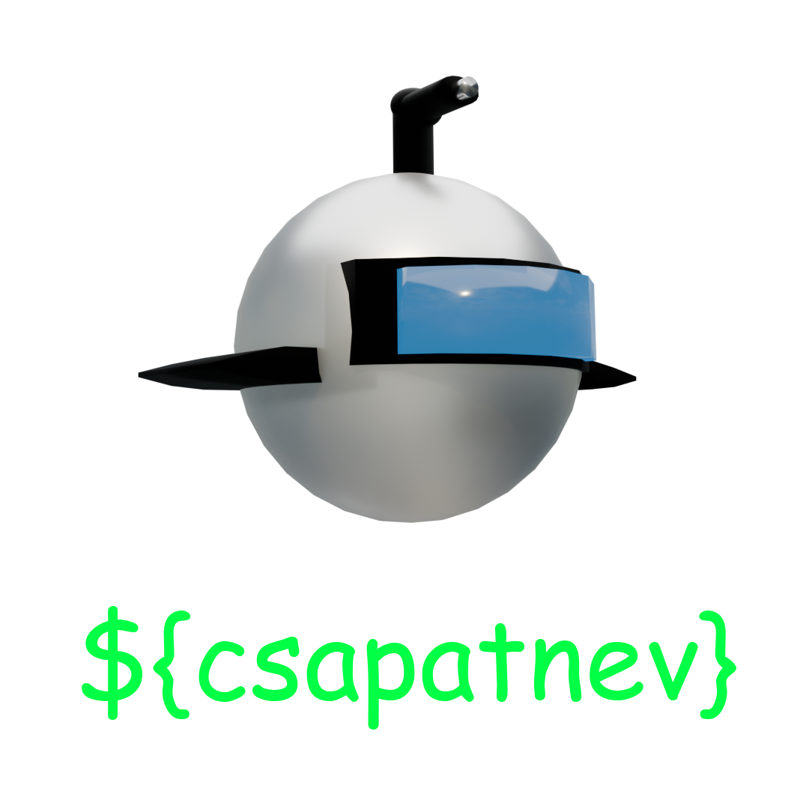
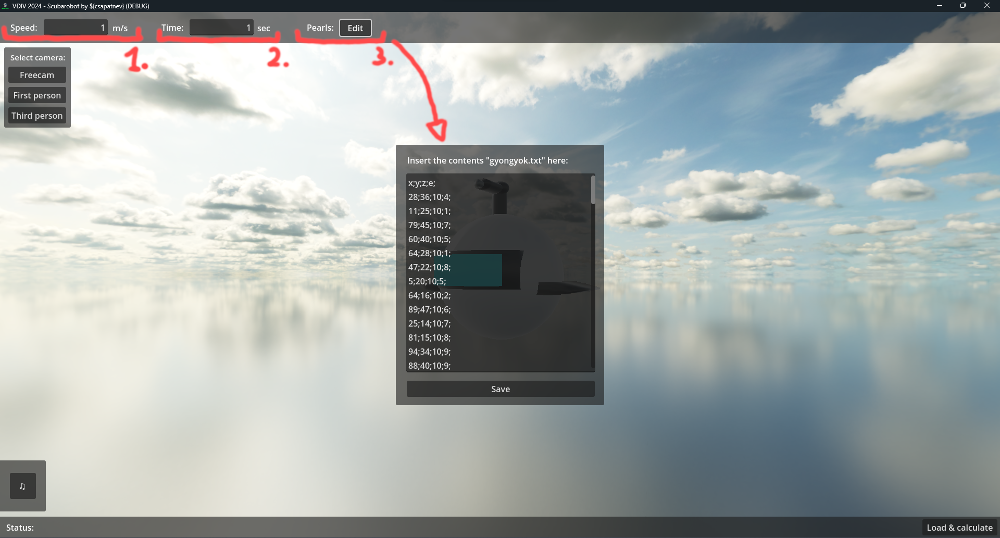
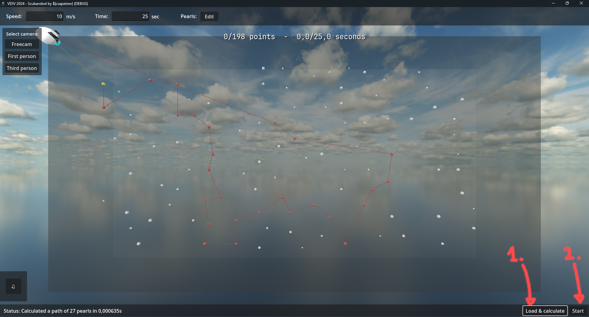

<h1 style="text-align: center;">VDIV 2024 Búvárrobot - by <code>${csapatnev}</code></h1>

# A program indítása

Az indításhoz futtassa le a `build` mappában lévő `scubarobot.exe` programot. 

# A program használata

### 1. Adatok bevitele

A felső sávban lehet megadni a sebességet és az időkorlátot.

Mellettük lehet lenyitni a `gyongyok.txt` szerkesztőjét, ahova a program indításkor beolvassa a fájl tartalmát, amennyiben talál ilyen nevű fájlt az indítási mappában.

### 2. Adatok betöltése, útvonal kiszámítása, és a szimuláció indítása

Az alsó sávban a `Load & calculate` gomb megnyomása után a program kiszámolja az optimális útvonalat és vizualizálja.

A `Start` gomb megnyomásával elindul a szimuláció. Ezután az ugyan ott elhelyezkedő gombbal lehet szüneteltetni és folytatni, illetve az másik gombbal újra betölthetőek frissített adatok.

#### A gyöngyök- és vonalak színkódolása:

- Fehér: alapértelmezett.
- Szürke: túl messze van, önmagában sem fér bele az időbe hogy a robot felszedje.
- Piros: része a kiszámított útvonalnak.
- Sárga: a következő célpont.
- Kék: már összegyűjtött.

### 3. Váltás a kamerák között

3 kameraopció van:
- Freecam: szabadon mozgatható, az irányításhoz kattintson a képernyő közepére, útmutató a jobb felső sarokban.
- First person: A búvárrobot szemszöge.
- Third person: A búvérrobotot hátulról követő kamera.

### 4. Zene kezelése

A bal alsó sarokban lévő hangjegy gombbal előhozható a zene kezelőfelülete, itt ugorhatunk a következőre, megállíthatjuk, és állíthatjuk a hangerőt.

# A kereső algoritmus leírása

Miután beolvasta a gyöngyök adatait a program, kidobja azokat, amik az origótól mért `sebesség * idő / 2` sugarú körön kívül esnek.

Ezután mohón keresi mindig a következő lépést. Összehasonlítja a `távolság / érték` hányadosát az összes esélyes gyöngynek (ahol még nem járt, és belefér az időbe hogy elmenjen oda és visszaérjen az origóba), és a legalacsonyabbat választja ki.

Ez addig megy, ameddig el nem fogynak az esélyes gyöngyök. Ami akkor következik be, ha az összeset meglátogatta, vagy egyik meglátogatása után sem érne vissza az origóba időben.